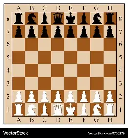
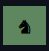

# **The "Game of the Century": The Final Project**

We are going to build a command-line program to replay the historic 1956 chess match between Donald Byrne and a 13-year-old Bobby Fischer. This game is famous for its brilliance and creativity.

### **Introduction to the Game of Chess**

First, let's get familiar with the chessboard and the pieces.

#### **Ranks and Files**


The chessboard is a grid of 8 rows and 8 columns. We use a coordinate system to refer to each of the 64 squares. Looking at the image you provided:

*   **Ranks**: These are the horizontal rows numbered **1 to 8**. The white pieces start on ranks 1 and 2, while the black pieces start on ranks 7 and 8.
*   **Files**: These are the vertical columns labeled with letters **a to h**.

Any square can be identified by its file letter followed by its rank number. For example, the bottom-left corner square is **a1**, and the top-right is **h8**.

#### **The Chess Pieces and Their Abbreviations**

Each player starts with 16 pieces. In chess notation, we use a single capital letter to represent each piece type.

| Piece Name | Abbreviation |
| :--- | :--- |
| **King** | K |
| **Queen** | Q |
| **Rook** | R |
| **Bishop** | B |
| **Knight** | N (K is already used for the King) |
| **Pawn** | P |

---

### **Let's Draw a Chess Square**

To "draw" our board in a terminal, we can't use images. Instead, we'll use colored text.

#### **Color Scheme and Rendering: A Code Tutorial**

We can control text color and background color in most modern terminals using special sequences of characters called **ANSI escape codes**. They act as instructions for the terminal.

Let's look at the `COLORS` dictionary:
```python
COLORS = {
    'bg_w': '\033[48;5;187m',
    'bg_b': "\033[48;5;65m",
    'fg_w': '\033[97m',
    'fg_b': '\033[30m',
}
RESET = "\033[0m"
```
Here's what each part means:
*   `\033[`: This is the "Control Sequence Introducer." It tells the terminal, "Get ready for a command!"
*   `48;5;187m`: This is the command itself.
    *   `48` means "set the background color."
    *   `5` means "use the 256-color palette."
    *   `187` is the specific color code from that palette (a light, off-white).
    *   `m` marks the end of the command.
*   `\033[97m`: A simpler command. `97` means "set the foreground (text) color to bright white."
*   `RESET = "\033[0m"`: This is the most important part. The code `0` means "reset all formatting." If we set a color, it stays active until we reset it. We must print this `RESET` code after our colored text to return the terminal to normal.

**Let's see it in action.** Run this Python code snippet in your terminal:

```python
# --- Code Tutorial: ANSI Colors ---

# Define our colors and the reset code
BG_BLUE = '\033[48;5;27m'   # A nice blue background
FG_YELLOW = '\033[38;5;226m' # A bright yellow foreground
RESET = "\033[0m"

# Let's print some text
print("This is the default terminal text.")

# Now, let's print with our colors
# Notice how we build the string: START_COLOR + YOUR_TEXT + RESET
colored_text = BG_BLUE + FG_YELLOW + "Wow! This text is yellow on a blue background!" + RESET
print(colored_text)

print("And now the terminal is back to normal, thanks to RESET.")

# What happens if we forget RESET?
print(BG_BLUE + FG_YELLOW + "Oh no, I forgot the reset code...")
print("See? The color spills over onto this line!")
print(RESET + "...phew, that's better.") # We can apply the reset later
```
#### **Chess Piece Icons**
We will use the following Unicode characters to represent our chess pieces, as defined in your PIECES_ICONS dictionary:
```python
PIECES_ICONS = {
    'R': '♜',        # (Rook)
    'N': '♞',        # (Knight)
    'B': '♝',        # (Bishop)
    'Q': '♛',        # (Queen)
    'K': '♚',        # (King)
    'P': '♟',        # (Pawn)
}
BLANK = "\u3000" 
```

BLANK ("\u3000") is a full-width space that ensures our empty squares are the same width as our pieces.

## **[Task 1]: Create a function to render a single chess square.**

Now, apply that knowledge. Write a Python function that takes a background color code, a foreground color code, and a piece icon (like '♜' or a blank space). The function should return a formatted string. Remember that the **piece icon** should be **centered** within a **3-character-wide space** (e.g., " ` ♜ ` ").

expected output:

With piece 

without piece 

---

### **Let's Draw a Chess Row**

To build a full board, we first need to build a single row. We'll represent a row as a list of 8 "square" dictionaries.

Here is a **complete example** of what the data for the starting white back rank (row 8 on the board, but index 7 in our data) would look like:

```python
# This is a full example of one row's data structure
a_complete_row = [
    {'color': 'light', 'is_active': False, 'piece': {'name': 'R', 'color': 'white'}},
    {'color': 'dark', 'is_active': True, 'piece': {'name': 'N', 'color': 'white'}},
    {'color': 'light', 'is_active': False, 'piece': None},
    {'color': 'dark', 'is_active': True, 'piece': None},
    {'color': 'light', 'is_active': False, 'piece': {'name': 'B', 'color': 'black'}},
    {'color': 'dark', 'is_active': False, 'piece': {'name': 'Q', 'color': 'black'}},
    {'color': 'light', 'is_active': True, 'piece': {'name': 'K', 'color': 'black'}},
    {'color': 'dark', 'is_active': False, 'piece': None}
]
```

## **[Task 2]: Create a function that renders a row.**

Write a function that takes a list of 8 square dictionaries (like the one above). It should loop through them, use your square-rendering function on each one, and concatenate the results into a single string representing the full row.

---

### **Let's Construct an Initial Starting Board Matrix**

Now we'll write the logic to generate the data for the entire board at the start of the game.

## **[Task 3]: Create a function that generates the initial board matrix and print it.**

Follow these precise steps to create the board data structure, which will be a list of 8 rows.

1.  Create an empty list called `board`.
2.  Define the piece order for the back ranks: `back_rank_pieces = ['R', 'N', 'B', 'Q', 'K', 'B', 'N', 'R']`.
3.  Loop through 8 rows (e.g., `for row_index in range(8)`).
4.  Inside that loop, create an empty list called `row_list` to store the squares for the current row.
5.  Loop through 8 columns (e.g., `for col_index in range(8)`).
    *   **Step 5 Detail:** Determine the square's color. If `(row_index + col_index) % 2 == 0`, the color is **'light'**. If it is odd, the color is **'dark'**.
6.  Initialize a variable `piece_data` to `None`. Then, based on the `row_index`, assign the correct pieces:
    *   If `row_index` is 0 (Black's back rank), `piece_data` will be a dictionary for the black piece from `back_rank_pieces`.
    *   If `row_index` is 1 (Black's pawns), `piece_data` will be for a black pawn.
    *   If `row_index` is 6 (White's pawns), `piece_data` will be for a white pawn.
    *   If `row_index` is 7 (White's back rank), `piece_data` will be for the white piece from `back_rank_pieces`.
7.  **Step 7 Detail:** Create a dictionary for the current square. It should look like this:
    ```python
    square = {
        'color': 'light',  # or 'dark', based on your calculation in step 5
        'is_active': False, # Always False for the initial board
        'piece': piece_data # This will be None or a piece dictionary
    }
    ```
    *   **`'color'`**: The background color of the square.
    *   **`'is_active'`**: A flag for whether the square should be highlighted. We'll ignore this for now.
    *   **`'piece'`**: This is `None` if the square is empty. If there is a piece, it is *another dictionary* like `{'name': 'P', 'color': 'white'}`.
8.  Add the `square` dictionary to the `row_list`.
9.  After the column loop finishes, add the completed `row_list` to the main `board`.
10. After the row loop finishes, return the `board`.

---

### **Let's Play the Game**

The `game_turns` list is the script for the entire game. It's a list where each item is a dictionary representing one turn.

Here is the complete game data:
```python
game_turns = [
      {"moves": [("g1", "f3")], "color": "white", "eat": None, "promotion": None},
      {"moves": [("g8", "f6")], "color": "black", "eat": None, "promotion": None},
      {"moves": [("c2", "c4")], "color": "white", "eat": None, "promotion": None},
      {"moves": [("g7", "g6")], "color": "black", "eat": None, "promotion": None},
      {"moves": [("b1", "c3")], "color": "white", "eat": None, "promotion": None},
      {"moves": [("f8", "g7")], "color": "black", "eat": None, "promotion": None},
      {"moves": [("d2", "d4")], "color": "white", "eat": None, "promotion": None},
      {"moves": [("e8", "g8"), ("h8", "f8")], "color": "black", "eat": None, "promotion": None}, # Black Castles
      {"moves": [("c1", "f4")], "color": "white", "eat": None, "promotion": None},
      {"moves": [("d7", "d5")], "color": "black", "eat": None, "promotion": None},
      {"moves": [("d1", "b3")], "color": "white", "eat": None, "promotion": None},
      {"moves": [("d5", "c4")], "color": "black", "eat": "P", "promotion": None}, # Black's pawn on d5 captures on c4
      {"moves": [("b3", "c4")], "color": "white", "eat": "P", "promotion": None}, # White's Queen on b3 captures on c4
      {"moves": [("c7", "c6")], "color": "black", "eat": None, "promotion": None},
      {"moves": [("e2", "e4")], "color": "white", "eat": None, "promotion": None},
      {"moves": [("b8", "d7")], "color": "black", "eat": None, "promotion": None},
      {"moves": [("a1", "d1")], "color": "white", "eat": None, "promotion": None},
      {"moves": [("d7", "b6")], "color": "black", "eat": None, "promotion": None},
      {"moves": [("c4", "c5")], "color": "white", "eat": None, "promotion": None},
      {"moves": [("c8", "g4")], "color": "black", "eat": None, "promotion": None},
      {"moves": [("f4", "g5")], "color": "white", "eat": None, "promotion": None},
      {"moves": [("b6", "a4")], "color": "black", "eat": None, "promotion": None},
      {"moves": [("c5", "a3")], "color": "white", "eat": None, "promotion": None},
      {"moves": [("a4", "c3")], "color": "black", "eat": "P", "promotion": None},
      {"moves": [("b2", "c3")], "color": "white", "eat": "N", "promotion": None},
      {"moves": [("f6", "e4")], "color": "black", "eat": "P", "promotion": None},
      {"moves": [("g5", "e7")], "color": "white", "eat": "P", "promotion": None},
      {"moves": [("d8", "b6")], "color": "black", "eat": None, "promotion": None},
      {"moves": [("f1", "c4")], "color": "white", "eat": None, "promotion": None},
      {"moves": [("e4", "c3")], "color": "black", "eat": "P", "promotion": None},
      {"moves": [("e7", "c5")], "color": "white", "eat": None, "promotion": None},
      {"moves": [("e8", "f8")], "color": "black", "eat": None, "promotion": None},
      {"moves": [("a1", "d1")], "color": "white", "eat": None, "promotion": None},
      {"moves": [("g4", "e6")], "color": "black", "eat": None, "promotion": None},
      {"moves": [("c5", "b6")], "color": "white", "eat": "Q", "promotion": None},
      {"moves": [("e6", "c4")], "color": "black", "eat": "B", "promotion": None},
      {"moves": [("d1", "e1")], "color": "white", "eat": None, "promotion": None},
      {"moves": [("c3", "e2")], "color": "black", "eat": None, "promotion": None},
      {"moves": [("e1", "f1")], "color": "white", "eat": None, "promotion": None},
      {"moves": [("e2", "d4")], "color": "black", "eat": "P", "promotion": None},
      {"moves": [("f1", "g1")], "color": "white", "eat": None, "promotion": None},
      {"moves": [("d4", "e2")], "color": "black", "eat": None, "promotion": None},
      {"moves": [("g1", "f1")], "color": "white", "eat": None, "promotion": None},
      {"moves": [("e2", "c3")], "color": "black", "eat": None, "promotion": None},
      {"moves": [("f1", "g1")], "color": "white", "eat": None, "promotion": None},
      {"moves": [("a7", "b6")], "color": "black", "eat": "B", "promotion": None},
      {"moves": [("a3", "b4")], "color": "white", "eat": None, "promotion": None},
      {"moves": [("a8", "a4")], "color": "black", "eat": None, "promotion": None},
      {"moves": [("b4", "b6")], "color": "white", "eat": "P", "promotion": None},
      {"moves": [("c3", "d1")], "color": "black", "eat": "R", "promotion": None},
      {"moves": [("h2", "h3")], "color": "white", "eat": None, "promotion": None},
      {"moves": [("a4", "a2")], "color": "black", "eat": None, "promotion": None},
      {"moves": [("g1", "h2")], "color": "white", "eat": None, "promotion": None},
      {"moves": [("d1", "f2")], "color": "black", "eat": "N", "promotion": None},
      {"moves": [("h1", "e1")], "color": "white", "eat": None, "promotion": None},
      {"moves": [("f8", "e8")], "color": "black", "eat": None, "promotion": None},
      {"moves": [("b6", "d8")], "color": "white", "eat": None, "promotion": None},
      {"moves": [("g7", "f8")], "color": "black", "eat": None, "promotion": None},
      {"moves": [("e1", "e8")], "color": "white", "eat": "R", "promotion": None},
      {"moves": [("c4", "d5")], "color": "black", "eat": None, "promotion": None},
      {"moves": [("e8", "f8")], "color": "white", "eat": None, "promotion": None},
      {"moves": [("f2", "e4")], "color": "black", "eat": None, "promotion": None},
      {"moves": [("d8", "b8")], "color": "white", "eat": None, "promotion": None},
      {"moves": [("b7", "b5")], "color": "black", "eat": None, "promotion": None},
      {"moves": [("h3", "h4")], "color": "white", "eat": None, "promotion": None},
      {"moves": [("h7", "h5")], "color": "black", "eat": None, "promotion": None},
      {"moves": [("f8", "e8")], "color": "white", "eat": None, "promotion": None},
      {"moves": [("f8", "g7")], "color": "black", "eat": None, "promotion": None},
      {"moves": [("h2", "g1")], "color": "white", "eat": None, "promotion": None},
      {"moves": [("d5", "c5")], "color": "black", "eat": None, "promotion": None},
      {"moves": [("g1", "f1")], "color": "white", "eat": None, "promotion": None},
      {"moves": [("e4", "g3")], "color": "black", "eat": None, "promotion": None},
      {"moves": [("f1", "e1")], "color": "white", "eat": None, "promotion": None},
      {"moves": [("c5", "b4")], "color": "black", "eat": None, "promotion": None},
      {"moves": [("e1", "d1")], "color": "white", "eat": None, "promotion": None},
      {"moves": [("b4", "b3")], "color": "black", "eat": None, "promotion": None},
      {"moves": [("d1", "c1")], "color": "white", "eat": None, "promotion": None},
      {"moves": [("g3", "e2")], "color": "black", "eat": None, "promotion": None},
      {"moves": [("c1", "b1")], "color": "white", "eat": None, "promotion": None},
      {"moves": [("e2", "c3")], "color": "black", "eat": None, "promotion": None},
      {"moves": [("b1", "c1")], "color": "white", "eat": None, "promotion": None},
      {"moves": [("a2", "c2")], "color": "black", "eat": None, "promotion": None}
]
```
#### **Let's break down one of these turn objects in extreme detail:**
```python
{"moves": [("d5", "c4")], "color": "black", "eat": "P", "promotion": None}
```
*   **`"color": "black"`**: This tells us whose turn it was. In this case, Black is moving.
*   **`"moves": [("d5", "c4")]`**: This is a list of the actual piece movements. Each movement is a tuple `(from_square, to_square)`. This one shows a single piece moving from square `d5` to square `c4`.
*   **`"eat": "P"`**: This key tells us if a capture happened. If it's `None`, no piece was captured. Here, the value is `"P"`, which means a **Pawn** was captured on square `c4`. The program must remove the piece from the destination square (`c4`) before moving the active piece there.
*   **`"promotion": None`**: This is for a special pawn move. If a pawn reaches the other side of the board, it can be promoted to a Queen, Rook, Bishop, or Knight. In this game, no promotions occurred, so this value is always `None`.
*   **A Special Case - Castling**: Look at turn 8: `{"moves": [("e8", "g8"), ("h8", "f8")]}`. When the `"moves"` list has two tuples, it signifies **castling**. This is a special move where the King (moving from `e8` to `g8`) and the Rook (moving from `h8` to `f8`) move simultaneously. Your program will need to handle both movements in a single turn.

## **[Final Task - Bonus]: Write the interactive game-playing program.**

Now, put everything together. Write a program that:
1.  Creates the initial board using your function.
2.  Starts a loop that will continue until the user types "quit".
3.  Inside the loop:
    *   Clears the screen and prints the current state of the board using your row and square rendering functions.
    *   Prompts the user for input: "next", "previous", or "quit".
    *   If the user types "next", apply the next move from the `game_turns` list to your board data. This involves finding the `from_square`, moving its piece data to the `to_square`, and setting the `from_square`'s piece to `None`.
    *   If the user types "previous", you will need to undo the last move.
    *   If the user types "quit", the loop should end.